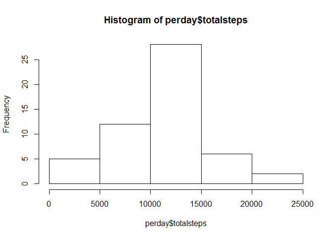
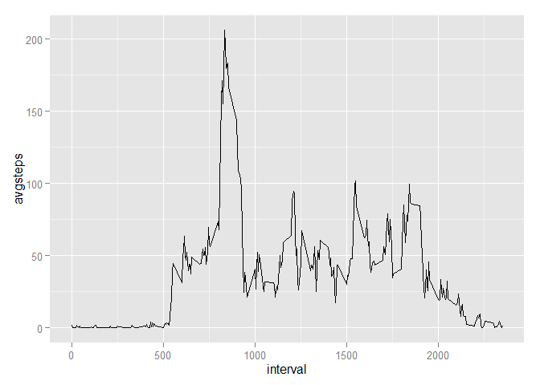
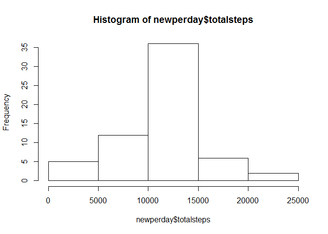
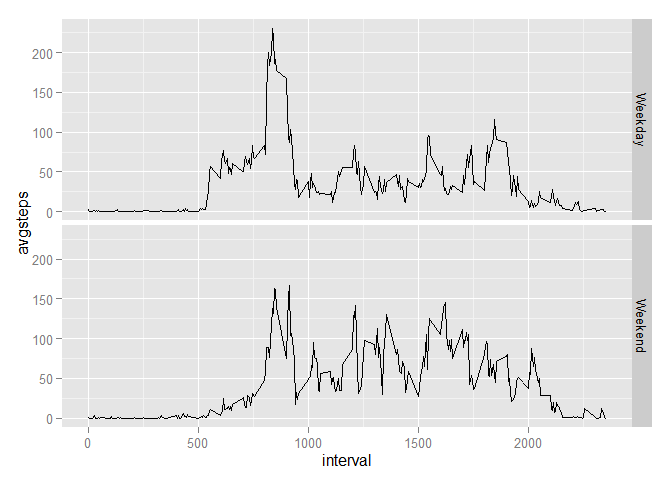

# Reproducible Research: Peer Assessment 1


## Loading and preprocessing the data
The presented code below loads the libraries dplyr and ggplot2, and also read the csv file.  

```r
library(dplyr)
```

```
## 
## Attaching package: 'dplyr'
## 
## The following objects are masked from 'package:stats':
## 
##     filter, lag
## 
## The following objects are masked from 'package:base':
## 
##     intersect, setdiff, setequal, union
```

```r
library(ggplot2)
activity <- read.csv("activity.csv")
```

## What is mean total number of steps taken per day?  

```r
perday <- group_by(activity,date)
perday <- summarise(perday,totalsteps = sum(steps))

perday.mean <- round(mean(perday$totalsteps,na.rm = TRUE),digits = 2)
perday.median <- median(perday$totalsteps,na.rm = TRUE)
hist(perday$totalsteps)  
```

 
  
  The mean of total number of steps taken per day is 1.076619\times 10^{4} and the median is 10765

## What is the average daily activity pattern?

```r
daily <- group_by(activity,interval)
daily <- summarise(daily,avgsteps = mean(steps,na.rm = TRUE))
maxnuminterval <- daily[order(daily$avgsteps,decreasing=TRUE),][1,"interval"]
qplot(interval,avgsteps,data=daily,geom="line")
```

 
  
  The 5-minute interval containing the maximum number of steps is 835  
  
## Imputing missing values

```r
ttlmissing <- sum(!complete.cases(activity))

new <- merge(activity,daily,by.x = "interval",by.y = "interval")
new[is.na(new$steps),"steps"] <- round(new[is.na(new$steps),"avgsteps"])
new <- new[,c(2,3,1)]
new <- new[order(new$date,new$interval),]
row.names(new) <- 1:nrow(new)

newperday <- group_by(new,date)
newperday <- summarise(newperday,totalsteps = sum(steps))

newperday.mean <- mean(newperday$totalsteps)
newperday.median <-median(newperday$totalsteps)
hist(newperday$totalsteps)
```

 
  
  The total count of missing values is 2304  
  The mean of total number of steps taken per day, after imputing missing data, is 1.0765639\times 10^{4} and the median is 1.0762\times 10^{4}  
  
## Are there differences in activity patterns between weekdays and weekends?

```r
new$dow<-weekdays(as.POSIXlt(new$date,format = "%Y-%m-%d"),abbreviate = TRUE)
new$weekday <- ifelse(new$dow=="Sat" | new$dow=="Sun","Weekend","Weekday")
new$weekday <- factor(new$weekday)
new <- new[,c(1,2,3,5)]

newdaily <- group_by(new,interval,weekday)
newdaily <- summarise(newdaily,avgsteps = mean(steps,na.rm = TRUE))

qplot(interval,avgsteps,data=newdaily,geom="line",facets = weekday ~ .)
```

 
